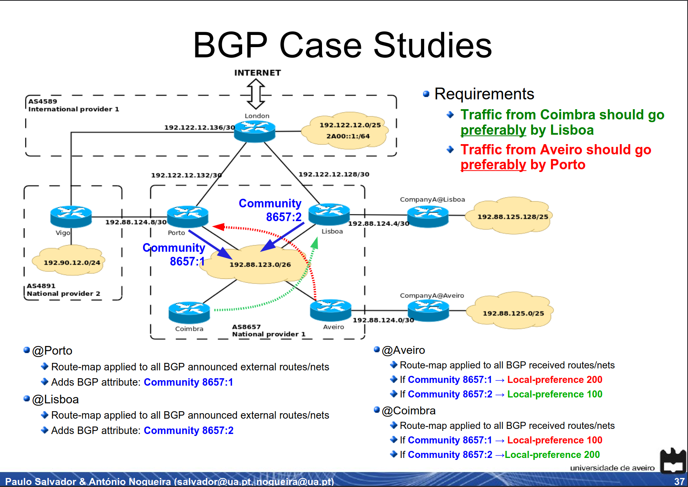
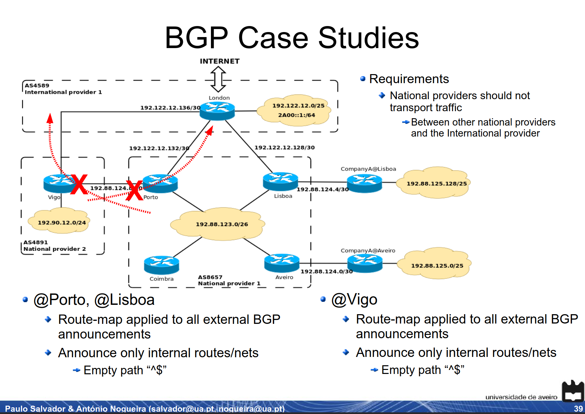
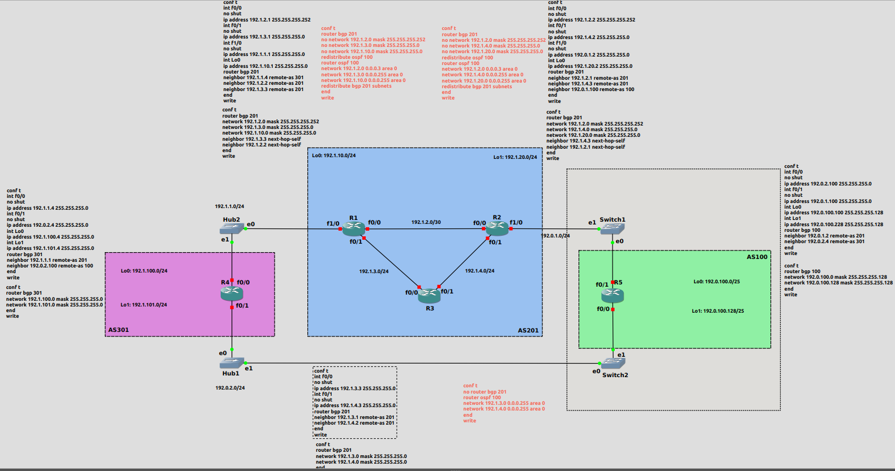
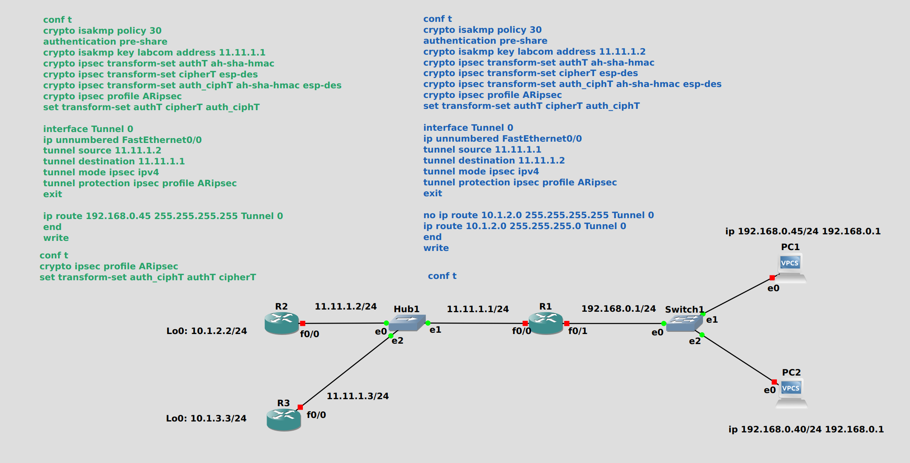

## BGP

1. Traffic from Coimbra should go preferably by Lisboa, while traffic from Aveiro should go preferably by Porto 
    - O tráfego que chega a Coimbra deve sair por lisboa. ou seja, a sair para a Internet, pra fora, deve ir por Lisboa
    - O tráfego que chega a Aveiro deve sair pelo Porto. ou seja, a sair para a Internet, pra fora, deve ir pelo Porto

2. National providers should not transport traffic between other national providers and the International provider 
    - O tráfego do National Provider 1 para a Internet deve ir direto para o International Provider, sem passar pelo National Provider 2
    - O tráfego do National Provider 2 para a Internet deve ir direto para o International Provider, sem passar pelo National Provider 1
    - Ou seja, National Providers não servem como trânsito para outros National Providers, cada um liga-se diretamente para fora

## MPLS

3. In  order  to  reduce  costs  and  have  a  better  security  control,  the  Sales  Department  of  CompanyA required a virtual private connection between the Aveiro and Lisboa poles, with a guaranteed bandwidth of  2Mbps. All  Videoconference  traffic  between  the Aveiro  and  Lisboa  poles  of  CompanyA  should  use this private connection. 
    - Configurar MPLS na rede do national provider1, no switch do centro, para fazer um tunel de aveiro pra lisboa, no caso do projeto é 2000 (nao 512 como no guiao), ou seja, usar o comando `ip rsvp bandwidth 2000 2000`

## IPSec

4. Due to security requirements, traffic between the Leiria and London networks should be encrypted
    - Tunel IPSec entre Leiria e Londres

## Other Notes

- É preciso BGP no National Provider 1 nos routers Porto, Lisboa, Coimbra e Aveiro
- É preciso BGP nos routers Coimbra e Aveiro para eu poder escolher por onde sair, ou seja, no router Coimbra configuro BGP para sair por Lisboa e no router Aveiro configuro para sair pelo Porto


## Slides Hints

### 1. Traffic from Coimbra should go preferably by Lisboa, while traffic from Aveiro should go preferably by Porto



### 2. National providers should not transport traffic between other national providers and the International provider



## OSPF Config Example



## Duvidas

### Internet

ta topo!

### Neighbors

porto vai ter neighbors Vigo Londres Lisboa Coimbra e Aveiro. Lisboa -> Porto Londres Coimbra e Aveiro

### Redes de ligacao entre AS

nao sao anunciadas


### Coimbra Antes

```txt
Coimbra#show ip bgp
BGP table version is 15, local router ID is 192.88.123.3
Status codes: s suppressed, d damped, h history, * valid, > best, i - internal,
              r RIB-failure, S Stale
Origin codes: i - IGP, e - EGP, ? - incomplete

   Network          Next Hop            Metric LocPrf Weight Path
* i100.100.100.0/24 192.1.1.133              0    100      0 4589 i
r i192.88.123.0/26  192.88.123.2             0    100      0 ?
r>i                 192.88.123.1             0    100      0 ?
r i192.88.124.0/30  192.88.123.4            20    100      0 ?
r>i                 192.88.123.4            20    100      0 ?
r>i192.88.124.4/30  192.88.123.2             0    100      0 ?
r i                 192.88.123.2            11    100      0 ?
r i192.88.125.64/26 192.88.123.5            20    100      0 ?
r>i                 192.88.123.5            20    100      0 ?
r>i192.88.125.128/26
                    192.88.124.6            11    100      0 ?
r i                 192.88.123.2            21    100      0 ?
r i192.88.125.192/26
                    192.88.123.4            30    100      0 ?
r>i                 192.88.123.4            30    100      0 ?
* i192.90.12.0      192.1.1.145              0    100      0 4891 i
* i192.122.12.0/25  192.1.1.133              0    100      0 4589 i

```

## IPsec config example

